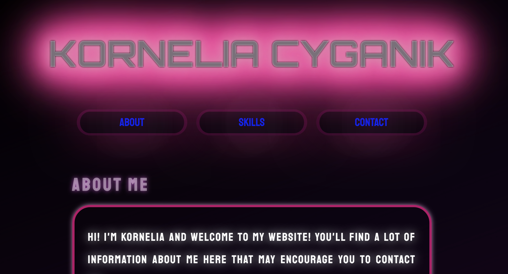

# 
TEST PORTFOLIO - just for fun!

  

## 
Demo

https://colourofmoonlight.github.io/HOMEPAGE-/

## 
Description

This is my test portfolio. 
I'm playing with new stuff here. Don't take this code deadly serious here! ;)

## 
Conventions

BEM
